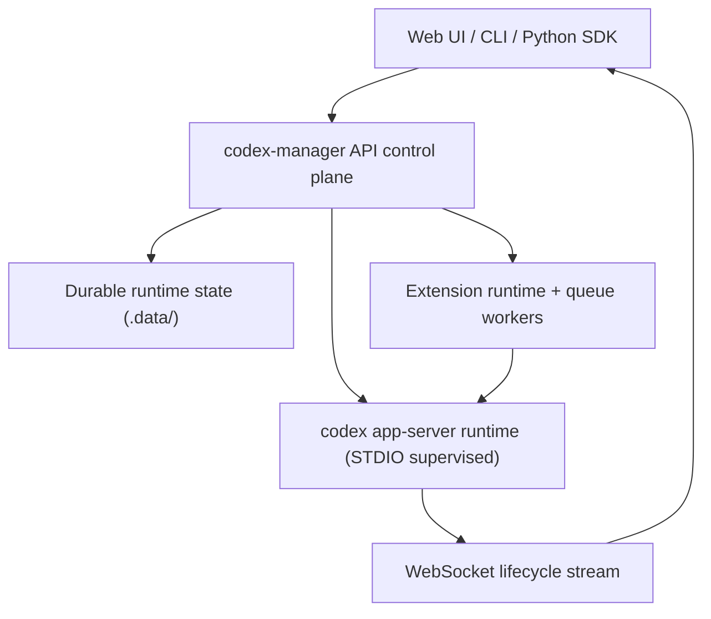

<p align="center">
  
</p>

<p align="center">
  <a href="./LICENSE"></a>
  
  
</p>

<p align="center"><strong>Codex Manager</strong> is a local-first control plane for Codex sessions.</p>
<p align="center">Web UI + CLI + Python SDK over one Fastify API supervising <code>codex app-server</code> with websocket lifecycle streaming and durable state under <code>.data/</code>.</p>

---

## Why Codex Manager

Codex runtime is powerful, but teams need a practical control plane around it:

- reproducible session/project lifecycle operations
- approval/tool-input/tool-call governance
- stream-aware transcript UX and operator diagnostics
- extension-driven queue automation without hard-coding workflow logic into API core

## 5-Minute Quickstart

Prerequisites:

- Node.js `>=24`
- pnpm `10.29.3`
- Codex CLI on `PATH`

Setup:

```bash
pnpm install
cp apps/api/.env.example apps/api/.env
cp apps/web/.env.example apps/web/.env
pnpm dev
```

Open:

- Web: `http://127.0.0.1:5173`
- API health: `http://127.0.0.1:3001/api/health`

Auth quick check:

```bash
curl -s http://127.0.0.1:3001/api/health | grep -Eq '"likelyUnauthenticated"[[:space:]]*:[[:space:]]*false' \
  && echo "Auth ready" || echo "Auth missing or not loaded"
```

## Architecture At A Glance



## Core Capabilities

- Session/project lifecycle (create, move, rename, archive, delete, bulk operations)
- Streamed transcript UX with approvals/tool-input/tool-call handling
- Session controls + generic per-session settings shared across UI/CLI/API/extensions
- Deterministic extension runtime dispatch with queue-backed automation
- Python SDK support for typed models, stream handlers, and remote skill bridges

## Python SDK (Minimal Useful Example)

```python
from codex_manager import CodexManager

with CodexManager.from_profile("local") as cm:
    session = cm.sessions.create(cwd=".")
    session_id = session["session"]["sessionId"]
    reply = cm.wait.send_message_and_wait_reply(
        session_id=session_id,
        text="Explain this repository in 5 concise bullets.",
    )
    print(reply.assistant_reply)
```

Install from this repository:

```bash
pip install -e packages/python-client
```

## Documentation Progression

Start at one level deeper docs, then follow each doc’s deeper links.

## L1 Foundations

- Product scope: [`docs/prd.md`](docs/prd.md)
- Architecture: [`docs/architecture.md`](docs/architecture.md)
- Protocol guide: [`docs/codex-app-server.md`](docs/codex-app-server.md)
- Operations index: [`docs/ops.md`](docs/ops.md)
- Python SDK intro: [`docs/python/introduction.md`](docs/python/introduction.md)
- Implementation snapshot: [`docs/implementation-status.md`](docs/implementation-status.md)

## L2 Operational Guides

- Setup/run: [`docs/operations/setup-and-run.md`](docs/operations/setup-and-run.md)
- CLI runbook: [`docs/operations/cli.md`](docs/operations/cli.md)
- Troubleshooting: [`docs/operations/troubleshooting.md`](docs/operations/troubleshooting.md)
- Generation/validation: [`docs/operations/generation-and-validation.md`](docs/operations/generation-and-validation.md)
- Extension authoring: [`docs/operations/agent-extension-authoring.md`](docs/operations/agent-extension-authoring.md)
- Extension lifecycle/conformance: [`docs/operations/agent-extension-lifecycle-and-conformance.md`](docs/operations/agent-extension-lifecycle-and-conformance.md)
- Queue framework: [`docs/operations/agent-queue-framework.md`](docs/operations/agent-queue-framework.md)

## L2 Protocol/Python Guides

- Protocol overview: [`docs/protocol/overview.md`](docs/protocol/overview.md)
- Core methods: [`docs/protocol/methods-core.md`](docs/protocol/methods-core.md)
- Integrations methods: [`docs/protocol/methods-integrations.md`](docs/protocol/methods-integrations.md)
- Event stream: [`docs/protocol/events.md`](docs/protocol/events.md)
- Harness runtime contracts: [`docs/protocol/harness-runtime-events.md`](docs/protocol/harness-runtime-events.md)
- Python quickstart: [`docs/python/quickstart.md`](docs/python/quickstart.md)
- Python API surface: [`docs/python/api-surface.md`](docs/python/api-surface.md)
- Python streaming/handlers: [`docs/python/streaming-and-handlers.md`](docs/python/streaming-and-handlers.md)
- Python remote skills: [`docs/python/remote-skills.md`](docs/python/remote-skills.md)
- Python typed models: [`docs/python/typed-models.md`](docs/python/typed-models.md)

## Repository Layout

```text
apps/      web, api, cli
packages/  shared SDKs/clients/contracts (including python-client)
docs/      L1->L2->L3 documentation tree
scripts/   generation, conformance, runtime utilities
.data/     local runtime/test artifacts (gitignored)
```

## Development Commands

```bash
pnpm dev
pnpm gen
pnpm typecheck
pnpm test
pnpm build
pnpm smoke:runtime
pnpm test:e2e
```

## Contributing and Support

- Contributing: [`CONTRIBUTING.md`](CONTRIBUTING.md)
- Code of Conduct: [`CODE_OF_CONDUCT.md`](CODE_OF_CONDUCT.md)
- Support: [`SUPPORT.md`](SUPPORT.md)

## License

Apache 2.0: [`LICENSE`](LICENSE)
