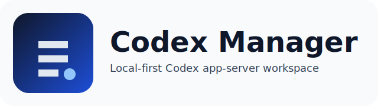
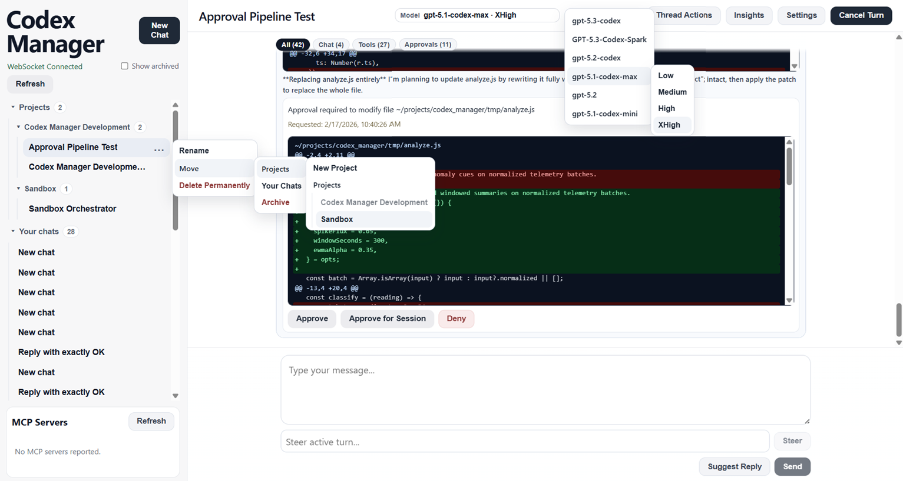

<p align="center">
  
</p>

<p align="center">
  <a href="./LICENSE"></a>
  
  
  
  
</p>

<p align="center"><strong>Codex Manager</strong> is a local-first Codex workspace for running, organizing, and supervising Codex chat threads through a browser UI.</p>
<p align="center">It pairs a React/Vite frontend with a Fastify API that supervises <code>codex app-server</code> over STDIO, streams protocol events over WebSocket, and keeps materialized session/project state durable under <code>.data/</code>.</p>

<p align="center"><code>pnpm install && cp apps/api/.env.example apps/api/.env && cp apps/web/.env.example apps/web/.env && pnpm dev</code></p>
<p align="center">Before sending your first turn, set <code>OPENAI_API_KEY</code> in <code>apps/api/.env</code> or ensure <code>~/.codex/auth.json</code> exists for bootstrap.</p>

<p align="center"><a href="https://github.com/jmillpps/codex-manager/issues">Issues</a> · <a href="https://github.com/jmillpps/codex-manager/issues/new">Report a Bug</a> · <a href="https://github.com/jmillpps/codex-manager/discussions">Discussions</a> · <a href="./CONTRIBUTING.md">Contributing</a></p>

<p align="center">
  
</p>

---

## Table of Contents

- [Quickstart](#quickstart)
- [Why This Project Exists](#why-this-project-exists)
- [Feature Highlights](#feature-highlights)
- [Backstory](#backstory)
- [Getting Started (Detailed)](#getting-started-detailed)
- [Repository Layout](#repository-layout)
- [Documentation Map](#documentation-map)
- [Contributing](#contributing)
- [Support](#support)
- [License](#license)

---

## Quickstart

Install prerequisites and verify your environment:

```bash
node --version
pnpm --version
codex --version
codex app-server --help
```

This README assumes a Unix-like shell environment (`bash`, `zsh`, or `sh`).

From the repository root:

```bash
pnpm install
cp apps/api/.env.example apps/api/.env
cp apps/web/.env.example apps/web/.env

# Choose one auth path before sending turns.
# Option A (recommended): set OPENAI_API_KEY in apps/api/.env
# edit apps/api/.env and set:
# OPENAI_API_KEY=your_key_here

# Option B: ensure ~/.codex/auth.json exists for startup bootstrap into CODEX_HOME

pnpm dev
```

Open:

- `http://127.0.0.1:5173` (web)
- `http://127.0.0.1:3001/api/health` (api health)

Then verify auth readiness:

```bash
curl -s http://127.0.0.1:3001/api/health | grep -Eq '"likelyUnauthenticated"\\s*:\\s*false' \
  && echo "Auth ready" || echo "Auth missing or not loaded"
```

<details>
<summary>Alternative auth modes (API key vs Codex home state)</summary>

The API supports either auth path:

- set `OPENAI_API_KEY` in `apps/api/.env`, or
- use existing Codex auth state in `CODEX_HOME/auth.json` (startup can bootstrap from `~/.codex/auth.json` when available).

If auth is missing, health may still return `ok`, but turns can fail with `401` when model calls begin.

</details>

---

## Why This Project Exists

Codex app-server exposes a rich runtime/protocol surface, but teams still need a practical local workspace that combines:

- consistent session lifecycle control
- project-level organization
- approval and tool-input workflows
- stream-aware UI behavior
- reproducible operations and troubleshooting runbooks

Codex Manager focuses on that layer while keeping Codex as the execution authority.

---

## Feature Highlights

- Local-first architecture with API + web stack and repo-local state under `.data/`
- Session and project workflows:
  - create/rename/archive/unarchive/delete chats
  - assign/move chats across projects and unassigned views
  - bulk project chat move/delete operations
- Materialization-aware behavior:
  - loaded non-materialized chats are visible and movable
  - archive constraints enforced when rollout is not yet materialized
- Live streaming transcript with category filters (`All`, `Chat`, `Tools`, `Approvals`)
- Turn-group transcript UX: one user request card plus one consolidated response bubble per turn, with a top thought area (`Working...` / `Worked for …`) and bottom final assistant response text
- Approval and tool input actions surfaced inline in response thought details
- Session transcript reload path merges streamed runtime tool/approval events so thought auditing remains visible even when `thread/read` omits raw tool items
- Thread control surface:
  - `fork`, `steer`, `interrupt`, `compact`, `rollback`, `review/start`, `backgroundTerminals/clean`
- Capability/integration settings:
  - combined `Model -> Reasoning` selection (model-aware effort options), account state, MCP status/oauth, skills, config, collaboration modes, experimental features
- Cross-client sidebar synchronization via websocket events
- Right-pane blocking modal when an active session is deleted

---

## Backstory

This repository started as a docs-first effort to lock down product scope, protocol semantics, lifecycle guarantees, and operations before broad implementation.

That foundation now drives an active codebase with runtime verification harnesses, browser-level smoke tests, and a split documentation tree designed for maintainability as the protocol and UI evolve.

---

## Getting Started (Detailed)

### 1) Requirements

- Node.js `>=24`
- pnpm `10.29.3`
- Codex CLI available on `PATH`

If you need to set pnpm via Corepack:

```bash
corepack enable
corepack prepare pnpm@10.29.3 --activate
```

### 2) Environment configuration

`apps/api/.env` default local baseline:

```env
HOST=127.0.0.1
PORT=3001
LOG_LEVEL=info
CODEX_BIN=codex
CODEX_HOME=.data/codex-home
DATA_DIR=.data
OPENAI_API_KEY=
DEFAULT_APPROVAL_POLICY=untrusted
DEFAULT_SANDBOX_MODE=read-only
```

`apps/web/.env` baseline:

```env
VITE_API_BASE=/api
VITE_API_PROXY_TARGET=http://127.0.0.1:3001
```

### 3) Development commands

```bash
pnpm dev               # api + web
pnpm dev:api           # api only
pnpm dev:web           # web only
pnpm gen               # openapi + api client generation
pnpm typecheck
pnpm test
pnpm build
pnpm smoke:runtime
pnpm test:e2e:list   # list browser suites
pnpm test:e2e        # run browser smoke (requires runtime auth + browser deps)
```

### 4) Data and artifact locations

This repository keeps default runs clean by writing runtime artifacts to ignored paths:

- runtime state: `.data/`
- codex home (recommended local): `.data/codex-home`
- playwright output: `.data/playwright-test-results`
- playwright linux dependency bootstrap cache: `.data/playwright-libs`

Ignored report/state directories:

- `test-results/`
- `playwright-report/`
- `blob-report/`
- `coverage/`

---

## Repository Layout

```text
apps/
  api/        Fastify API + Codex app-server supervisor
  web/        React/Vite frontend
packages/
  api-client/ Generated TypeScript API client
  codex-protocol/ Generated protocol schema/types
scripts/      Generation + runtime verification utilities
tests/e2e/    Playwright browser smoke coverage
docs/         Product, architecture, protocol, and operations knowledge tree
```

---

## Documentation Map

- Product requirements: [`docs/prd.md`](docs/prd.md)
- Architecture and invariants: [`docs/architecture.md`](docs/architecture.md)
- Codex protocol index: [`docs/codex-app-server.md`](docs/codex-app-server.md)
- Protocol deep dives: [`docs/protocol/`](docs/protocol/)
- Operations index: [`docs/ops.md`](docs/ops.md)
- Setup/validation/troubleshooting/maintenance runbooks: [`docs/operations/`](docs/operations/)
- Current implementation and verification status: [`docs/implementation-status.md`](docs/implementation-status.md)

---

## Contributing

Contributions are welcome.

Before opening a PR, read:

- [`CONTRIBUTING.md`](CONTRIBUTING.md)
- [`CODE_OF_CONDUCT.md`](CODE_OF_CONDUCT.md)

Highlights:

- use focused branches and explicit staging (`git add <file1> <file2>`)
- include validation results with your PR
- update documentation in the same change when behavior/workflow/config changes

---

## Support

For help, issue reports, and feature requests:

- Start with [`SUPPORT.md`](SUPPORT.md).
- Use [`Issues`](https://github.com/jmillpps/codex-manager/issues) for bugs and feature requests.
- Open a new ticket from [`New issue`](https://github.com/jmillpps/codex-manager/issues/new).
- Use [`Discussions`](https://github.com/jmillpps/codex-manager/discussions) for implementation questions.

If you suspect a security issue, do not post sensitive details publicly. Use a private reporting path if configured, or open a minimal issue requesting one.

---

## License

This project is licensed under the Apache 2.0 License.

See [`LICENSE`](LICENSE) for details.
