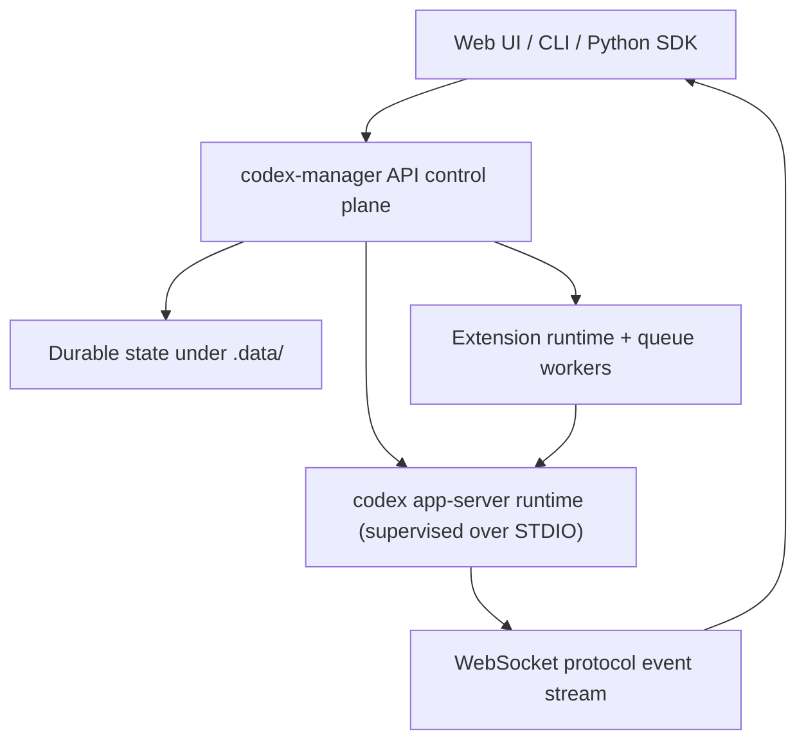

<p align="center">
  
</p>

<p align="center">
  <a href="./LICENSE"></a>
  
  
  
</p>

<p align="center"><strong>Codex Manager</strong> is a local-first control plane for Codex sessions.</p>
<p align="center">It combines a browser workspace, an operator CLI, and a Python SDK over a Fastify API that supervises <code>codex app-server</code> over STDIO, streams lifecycle events over WebSocket, and keeps durable state under <code>.data/</code>.</p>

<p align="center"><a href="https://github.com/jmillpps/codex-manager/issues">Issues</a> · <a href="https://github.com/jmillpps/codex-manager/issues/new">Report a Bug</a> · <a href="https://github.com/jmillpps/codex-manager/discussions">Discussions</a> · <a href="./CONTRIBUTING.md">Contributing</a></p>

<p align="center">
  
</p>

---

## Why Codex Manager

Codex app-server is the runtime authority, but most teams still need a practical workspace around it: session lifecycle control, approval/tool-input handling, stream-aware supervision, extension hooks, and reproducible operator workflows.

Codex Manager is that layer.

## Who This Is For

- Teams running Codex as part of local development workflows.
- Operators who need reproducible API/CLI/session controls and observability.
- Developers building automation and remote-tool bridges through Python.
- Extension authors building event-driven workflows without patching API core.

## 5-Minute Quickstart

Prerequisites:

- Node.js `>=24`
- pnpm `10.29.3`
- Codex CLI available on `PATH`

From repository root:

```bash
pnpm install
cp apps/api/.env.example apps/api/.env
cp apps/web/.env.example apps/web/.env
```

Pick one auth path before sending turns:

1. Recommended: set `OPENAI_API_KEY` in `apps/api/.env`.
2. Alternative: ensure `~/.codex/auth.json` exists (startup can bootstrap into local `CODEX_HOME`).

Start API + web:

```bash
pnpm dev
```

Open:

- Web: `http://127.0.0.1:5173`
- API health: `http://127.0.0.1:3001/api/health`

## First-Turn Smoke Test

1. Open the web app and create/select a chat.
2. Send: `Explain this repository in 5 bullets.`
3. Confirm all of the following:
   - Your user message transitions through `Sending` -> `Sent` -> `Delivered`.
   - Assistant response streams in the transcript.
   - The response finalizes with completion state/checkmark.
   - `GET /api/health` does not indicate `likelyUnauthenticated: true`.

CLI health/auth quick check:

```bash
curl -s http://127.0.0.1:3001/api/health | grep -Eq '"likelyUnauthenticated"[[:space:]]*:[[:space:]]*false' \
  && echo "Auth ready" || echo "Auth missing or not loaded"
```

## Quick Troubleshooting

| Symptom | Check | Fix |
| --- | --- | --- |
| Turn fails with auth error | `GET /api/health` shows `likelyUnauthenticated: true` | Set `OPENAI_API_KEY` or ensure Codex auth state exists |
| Web app cannot connect | API health URL unavailable | Start with `pnpm dev` or `pnpm dev:api` |
| No stream updates | Browser devtools websocket/network | Verify API is running and websocket upgrade is not blocked |
| Extension changes not reflected | Extension inventory/reload endpoints | `POST /api/agents/extensions/reload` then re-check inventory |
| Python script cannot connect | `CODEX_MANAGER_API_BASE` and profile config | Point client to running API (`http://127.0.0.1:3001`) |

For complete runbooks: [`docs/operations/troubleshooting.md`](docs/operations/troubleshooting.md)

## Architecture At A Glance



In practice:

- Interfaces (web, CLI, Python) all use the same API surface.
- The API supervises `codex app-server` and fans runtime stream events back to clients.
- Extensions and queue workers run through the API and interact with the same runtime.
- Metadata, settings, and orchestration state remain durable under `.data/`.

More detail: [`docs/architecture.md`](docs/architecture.md)

## Core Capabilities

### Session and Project Operations

- Chat/project lifecycle: create, rename, archive/unarchive, delete, move, and bulk project operations.
- Materialization-aware constraints for not-yet-materialized chat data.
- Consolidated turn transcript rendering with approval/tool-input visibility.
- Session-switch race protections to prevent stale hydration leakage.

### Runtime Controls and Governance

- Session Controls panel with explicit apply/revert for:
  - `model`
  - `approval policy` (`untrusted`, `on-failure`, `on-request`, `never`)
  - `network access`
  - `filesystem sandbox`
- Supervisor controls in the same panel (stored as generic session settings):
  - `Diff Explainability`
  - `Auto Approve` (default off, threshold `low`)
  - `Auto Reject` (default off, threshold `high`)
  - `Auto Steer` (default off, threshold `high`)

### Automation Surfaces

- Endpoint-complete REST + websocket API surface in `apps/api`.
- Operator CLI parity in `apps/cli`.
- Generic per-session settings storage shared across UI, CLI, API, and extensions.
- Runtime routes for session utility, tool-call response, and stream-driven automation.

### Extension Runtime Platform

- Deterministic event fanout with timeout isolation and typed envelopes.
- Source discovery across repo-local, package roots, and configured roots.
- App-server signal pass-through families for extension subscribers:
  - `app_server.<normalized_method>`
  - `app_server.request.<normalized_method>`
- Lifecycle inventory/reload APIs with RBAC and trust/capability enforcement.

## Python SDK

The Python SDK (`packages/python-client`) provides sync/async clients, typed OpenAPI models, wait helpers, settings wrappers, streaming handlers, and remote skill bridges for dynamic tool-call workflows.

Install from this repository:

```bash
pip install -e packages/python-client
```

Simple, generally useful example:

```python
from codex_manager import CodexManager

with CodexManager.from_profile("local") as cm:
    session = cm.sessions.create(cwd=".")
    session_id = session["session"]["sessionId"]

    reply = cm.wait.send_message_and_wait_reply(
        session_id=session_id,
        text="Explain this repository in 5 concise bullets.",
    )

    print(reply.assistant_reply)
```

Start here: [`docs/python/introduction.md`](docs/python/introduction.md)

Deep dives:

- [`docs/python/quickstart.md`](docs/python/quickstart.md)
- [`docs/python/practical-recipes.md`](docs/python/practical-recipes.md)
- [`docs/python/team-mesh.md`](docs/python/team-mesh.md)
- [`docs/python/remote-skills.md`](docs/python/remote-skills.md)
- [`docs/python/streaming-and-handlers.md`](docs/python/streaming-and-handlers.md)
- [`docs/python/typed-models.md`](docs/python/typed-models.md)
- [`docs/python/api-surface.md`](docs/python/api-surface.md)

## Build and Operate Extensions

Codex Manager supports extension-driven automation without adding workflow logic directly to API core.

Extension roots can be loaded from:

- `agents/*` (repo local)
- `AGENT_EXTENSION_PACKAGE_ROOTS`
- `AGENT_EXTENSION_CONFIGURED_ROOTS`

Runtime includes deterministic dispatch, queue action execution, lifecycle reload/inventory, and trust/capability enforcement.

Start here:

- Authoring: [`docs/operations/agent-extension-authoring.md`](docs/operations/agent-extension-authoring.md)
- Queue framework: [`docs/operations/agent-queue-framework.md`](docs/operations/agent-queue-framework.md)
- Lifecycle + conformance: [`docs/operations/agent-extension-lifecycle-and-conformance.md`](docs/operations/agent-extension-lifecycle-and-conformance.md)
- SDK contracts: [`docs/protocol/agent-runtime-sdk.md`](docs/protocol/agent-runtime-sdk.md)

## Choose Your Path

- Product intent and scope: [`docs/prd.md`](docs/prd.md)
- Architecture and invariants: [`docs/architecture.md`](docs/architecture.md)
- Setup and local runbook: [`docs/operations/setup-and-run.md`](docs/operations/setup-and-run.md)
- CLI operations: [`docs/operations/cli.md`](docs/operations/cli.md)
- API service supervision (`systemd --user`): [`docs/operations/api-service-supervision.md`](docs/operations/api-service-supervision.md)
- Validation and release gates: [`docs/operations/release-gate-checklist.md`](docs/operations/release-gate-checklist.md)
- Codex protocol reference index: [`docs/codex-app-server.md`](docs/codex-app-server.md)
- Current implementation status: [`docs/implementation-status.md`](docs/implementation-status.md)

## Repository Layout

```text
apps/
  api/        Fastify API + Codex app-server supervisor
  cli/        CLI for endpoint-complete API/websocket workflows
  web/        React/Vite frontend
packages/
  agent-runtime-sdk/ Canonical extension contracts
  api-client/ Generated TypeScript API client
  codex-protocol/ Generated protocol schema/types
  python-client/ Python SDK for API + streaming + remote skills
scripts/      Generation, conformance, and runtime utilities
tests/e2e/    Playwright smoke/e2e coverage
docs/         Product, architecture, protocol, and operations docs
```

## Development Commands

```bash
pnpm dev               # api + web
pnpm dev:api           # api only
pnpm dev:web           # web only
pnpm gen               # openapi + api client generation
pnpm typecheck
pnpm test
pnpm build
pnpm smoke:runtime
pnpm test:e2e:list
pnpm test:e2e
```

Runtime/test artifacts are written to ignored paths (primarily `.data/`).

## Contributing

Before opening a PR, read:

- [`CONTRIBUTING.md`](CONTRIBUTING.md)
- [`CODE_OF_CONDUCT.md`](CODE_OF_CONDUCT.md)

Expectations:

- Use focused branches and explicit staging.
- Include validation evidence in your PR.
- Update docs in the same change whenever behavior/workflow/config changes.

## Support

- Start with [`SUPPORT.md`](SUPPORT.md)
- Bugs/features: [`Issues`](https://github.com/jmillpps/codex-manager/issues)
- New ticket: [`New issue`](https://github.com/jmillpps/codex-manager/issues/new)
- Implementation questions: [`Discussions`](https://github.com/jmillpps/codex-manager/discussions)

## License

This project is licensed under Apache 2.0.

See [`LICENSE`](LICENSE) for details.
