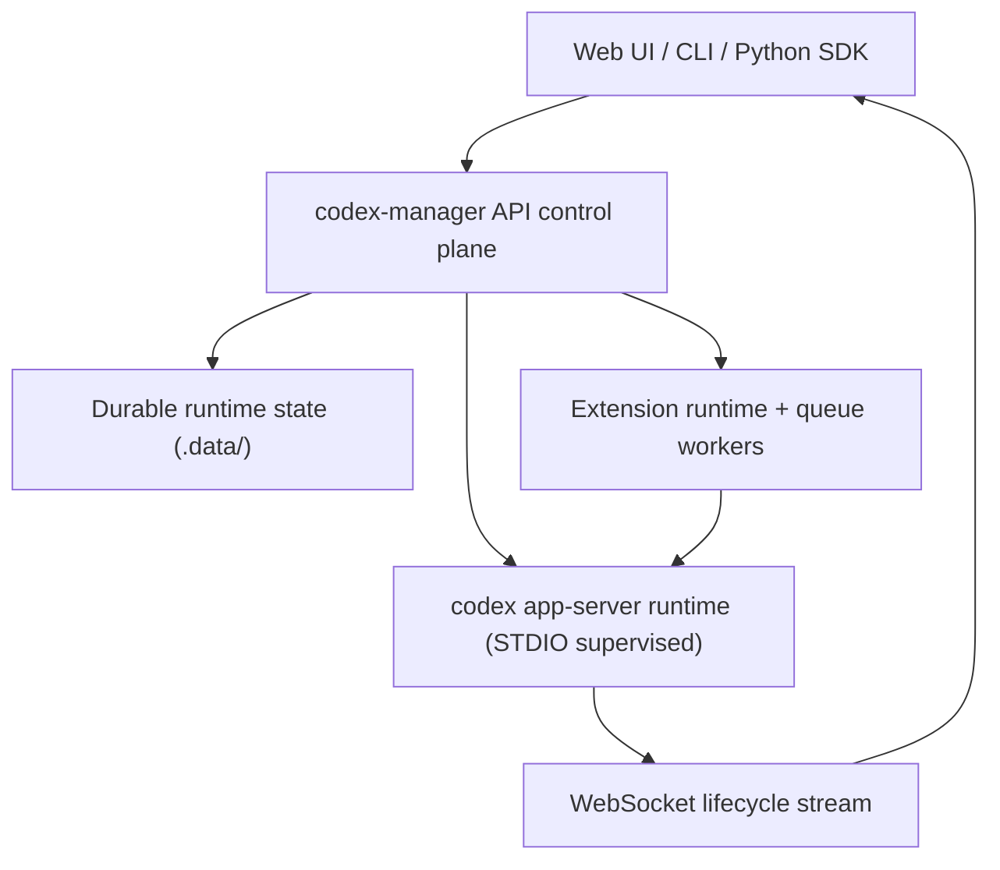

<p align="center">
  
</p>

<p align="center">
  <a href="./LICENSE"></a>
  
  
  
  
  
  
  
</p>

<p align="center"><strong>Codex Manager</strong> is a local-first control plane for Codex that turns <code>codex app-server</code> into a complete operator and automation platform.</p>
<p align="center">Web UI for interactive operations, CLI for terminal workflows, and Python SDK for programmable orchestration over one supervised Fastify API runtime.</p>
<p align="center">The API supervises <code>codex app-server</code> over STDIO, fans out real-time websocket lifecycle events, and persists durable runtime state under <code>.data/</code>.</p>

---

## What is Codex Manager

Codex Manager is a complete operating layer for Codex sessions that provides:

- **Fastify API** that supervises `codex app-server` and exposes a stable control surface
- **Extension runtime + queue orchestration** for deterministic automation and policy-driven actions
- **WebSocket stream** for live lifecycle events, approvals, tool-input requests, and tool-call routing
- **Web UI** for interactive session and project operations
- **CLI** for terminal-first workflows and scripting
- **Python SDK** for automation, event handling, and remote skill function execution

If you are starting fresh:

1. Run the quickstart and bring up API + Web.
2. Send a turn in a session and observe lifecycle events.
3. Add automation through the CLI or Python SDK.

## Quick Start

Run this once to bring up the API and Web app locally.

Prerequisites:

- Node.js `>=24`
- pnpm `10.29.3`
- Codex CLI available on `PATH`

Setup and start:

```bash
pnpm install
cp apps/api/.env.example apps/api/.env
cp apps/web/.env.example apps/web/.env
pnpm dev
```

Verify services:

- Web UI: `http://127.0.0.1:5173`
- API health: `http://127.0.0.1:3001/api/health`

Quick auth/runtime check:

```bash
curl -s http://127.0.0.1:3001/api/health | grep -Eq '"likelyUnauthenticated"[[:space:]]*:[[:space:]]*false' \
  && echo "Auth ready" || echo "Auth missing or not loaded"
```

CLI quick checks (same API surface, terminal-first):

```bash
pnpm --filter @repo/cli dev -- system health
pnpm --filter @repo/cli dev -- sessions list --limit 5
pnpm --filter @repo/cli dev -- system capabilities
```

`system capabilities` intentionally uses low-impact probe calls. In the `details` block, validation errors such as `missing field` or `invalid type` usually mean a method is present but the probe payload was intentionally small; `unknown variant` indicates the runtime does not expose that method.

Once CLI is built/installed, use `codex-manager` (or `cmgr`) directly with the same commands.

## Repository Layout

```text
apps/      web, api, cli
packages/  shared SDKs/clients/contracts (including python-client)
docs/      L1->L2->L3 documentation tree
scripts/   generation, conformance, runtime utilities
.data/     local runtime/test artifacts (gitignored)
```

## Development Commands

- `pnpm dev`: Run API and Web dev servers together with hot reload.
- `pnpm gen`: Regenerate OpenAPI specs and the generated TypeScript API client.
- `pnpm typecheck`: Run workspace type checks for all packages/apps that define a typecheck script.
- `pnpm test`: Run workspace test suites for all packages/apps that define a test script.
- `pnpm build`: Build all packages/apps that define a build script.
- `pnpm smoke:runtime`: Run the runtime smoke harness to validate API + websocket lifecycle behavior.
- `pnpm test:e2e`: Run Playwright end-to-end tests through the project e2e runner.

## Authentication and Credential Resolution

Codex Manager does not implement a separate identity system. It supervises `codex app-server`, and authentication is whatever that runtime can use at execution time. In practice, your runtime credentials come from `CODEX_HOME` auth state, API environment variables, or account login actions routed through codex-manager.

The important model is:

1. codex-manager starts and supervises `codex app-server`.
2. The child runtime receives process environment plus `CODEX_HOME` (when configured).
3. All account/login routes in codex-manager proxy to app-server account methods.
4. App-server remains the final authority for which credential path is used for a given request.

### Credential sources codex-manager supports

- `CODEX_HOME/auth.json`
  - Runtime auth file used by Codex.
  - `CODEX_HOME` also scopes runtime state directories (for example session state and shell snapshots).
- `OPENAI_API_KEY` in `apps/api/.env`
  - Environment-based credential path inherited by the supervised runtime.
- Account login endpoints
  - `POST /api/account/login/start`
  - `POST /api/account/login/cancel`
  - `POST /api/account/logout`
  - `GET /api/account`

### Startup behavior and effective precedence

On API startup, codex-manager performs a bootstrap step for local usability:

1. If `CODEX_HOME` is configured, it checks for `CODEX_HOME/auth.json`.
2. If that file is missing and `~/.codex/auth.json` exists, codex-manager copies that file into `CODEX_HOME`.
3. This allows an already-logged-in local Codex install to work immediately with an isolated `CODEX_HOME`.

Auth readiness in `/api/health` is reported by three fields:

- `hasOpenAiApiKey`
- `codexHomeAuthFile`
- `likelyUnauthenticated`

`likelyUnauthenticated` becomes `false` when either the API key is present or the auth file exists. This is a readiness signal, not a claim that codex-manager is choosing one source over another. codex-manager does not apply a manager-side credential tie-breaker; app-server resolves usable credentials at call time.

### Practical configuration patterns

Use one pattern per environment and keep it consistent to avoid ambiguity.

1. Local developer workstation (reuse existing Codex login)
   - Run `codex login` once.
   - Keep `CODEX_HOME` set (default in `apps/api/.env.example` is `.data/codex-home`).
   - Start codex-manager; startup bootstrap will copy `~/.codex/auth.json` into `CODEX_HOME` when needed.

2. Isolated environment or dedicated operator profile
   - Set a dedicated `CODEX_HOME` path (for example `.data/codex-home-prodlike`).
   - Authenticate through account login endpoints/CLI, or pre-seed `CODEX_HOME/auth.json`.
   - This keeps runtime auth/session state scoped to that environment.

3. Non-interactive key-based setup (automation/CI)
   - Set `OPENAI_API_KEY` in API env.
   - Restart API to ensure the supervised runtime inherits the updated environment.

### Account login surfaces (API, CLI, Python SDK)

In most local setups, authentication is already handled for you via existing `CODEX_HOME/auth.json` state (including startup bootstrap from `~/.codex/auth.json`) or `OPENAI_API_KEY`. Use the login flows below only when you need to establish or replace credentials.

API Login:

- `GET /api/account`
- `POST /api/account/login/start` with one of:
  - `{ "type": "apiKey", "apiKey": "..." }`
  - `{ "type": "chatgpt" }`
  - `{ "type": "chatgptAuthTokens", "accessToken": "...", "chatgptAccountId": "...", "chatgptPlanType": "..." }`
- `POST /api/account/login/cancel` with `{ "loginId": "..." }`
- `POST /api/account/logout`
- `GET /api/account/rate-limits`

CLI Login:

```bash
pnpm --filter @repo/cli dev -- account get
pnpm --filter @repo/cli dev -- account login start --type chatgpt
pnpm --filter @repo/cli dev -- account login start --type apiKey --api-key "$OPENAI_API_KEY"
pnpm --filter @repo/cli dev -- account login start --type chatgptAuthTokens --access-token "<token>" --chatgpt-account-id "<id>"
pnpm --filter @repo/cli dev -- account login cancel --login-id "<id>"
pnpm --filter @repo/cli dev -- account logout
pnpm --filter @repo/cli dev -- account rate-limits
```

Install Python SDK from this repository:

```bash
pip install -e packages/python-client
```

Python SDK Login:

```python
from codex_manager import CodexManager

with CodexManager.from_profile("local") as cm:
    auth = cm.system.health()["auth"]
    if auth["likelyUnauthenticated"]:
        started = cm.account.login_start_chatgpt()
        print("Open this URL to complete login:", started["result"]["authUrl"])
        # Or: cm.account.login_start_api_key("sk-...")
    else:
        print("Auth already available; login_start_* is optional.")
```

If `CODEX_HOME/auth.json` or `OPENAI_API_KEY` is already available, you do not need to call `login_start_*`.

## Session Automation

Use the Python SDK to automate a session by creating it, sending a request, and waiting for the final assistant reply. The same pattern extends to session controls, stream handlers, remote skills, and multi-session workflows.

```python
from codex_manager import CodexManager

with CodexManager.from_profile("local") as cm:
    session = cm.sessions.create(cwd=".")
    reply = cm.wait.send_message_and_wait_reply(
        session_id=session["session"]["sessionId"],
        text="Give me a practical onboarding summary of this repository: its purpose, core components, and first commands to run.",
    )
    print(reply.assistant_reply)
```

This workflow is straightforward to run in scripts and CI: one helper handles send + wait, keeps control flow linear, and avoids additional event-loop wiring when you only need a final answer; see the later [Python SDK](#python-sdk) section for an example streaming solution.

## How Codex Manager Works

This section focuses on flow. The section above defines the surfaces and capabilities; this one explains how requests and events move through the runtime.

### Request Flow

- API startup launches and supervises `codex app-server` over STDIO JSON-RPC and performs runtime/auth checks.
- Client requests enter the same `/api` control surface and are translated to app-server JSON-RPC methods.
- On session message send, codex-manager resolves effective controls (model, approval policy, sandbox, network), then starts the turn.
- Operational state is persisted under `.data/` (session metadata, controls/settings, transcript supplements, queue state).

### Event and Interaction Flow

- Runtime notifications and server requests are normalized into `app_server.*` and `app_server.request.*` event families.
- Events are streamed over `/api/stream` with per-thread subscribe/unsubscribe filtering.
- Pending approvals, tool-input requests, and dynamic tool calls are surfaced through dedicated session APIs and resolved through explicit decision/response routes.
- System-owned worker sessions are isolated from normal user flows and auto-reconcile interactive runtime requests.

### Extensions, Queue, and Remote Skills

- Extensions subscribe to the same normalized event stream and run with guarded tools and capability/trust controls.
- Queue jobs are durable and policy-driven (dedupe, retries, cancellation) with websocket lifecycle events.
- Python remote skills are passed as `dynamicTools`; tool-call requests are surfaced through pending tool-call APIs and completed via `POST /api/tool-calls/:requestId/response`.

The topology below shows how clients, the control plane, the supervised runtime, and extension/queue infrastructure connect in one loop. Clients interact with codex-manager, codex-manager supervises and drives `codex app-server`, runtime events flow back over websocket streams, and extension workers run alongside the API while persisting operational state under `.data/`.



## Primary Workflows

Most teams start with standard Codex CLI workflows, then adopt Codex Manager to unlock advanced operating patterns on the same `codex app-server` with very little new implementation code:

- **Keep familiar Codex execution patterns**: continue running real turns against repository context, now with shared project/session structure and live streamed visibility.
- **Standardize operations across surfaces**: use the same lifecycle flows in Web UI, CLI, and API so runbooks and scripts mirror interactive behavior instead of diverging from it.
- **Add execution-time governance**: apply model, approval, sandbox, and network controls per session while resolving approvals, tool-input, and tool-call requests as they happen.
- **Lift repeatable work into deterministic automation**: encode recurring behavior in extension handlers and durable queue jobs.
- **Evolve into cooperative agent frameworks**: use Python remote skills plus lifecycle synchronization to compose agent networks in supervisorless topologies.

This is the paradigm shift Codex Manager provides: from single-interface Codex usage to programmable, governed, multi-agent systems, while preserving app-server authority and keeping development effort low.

## Python SDK Remote Skills

Previously we've gone over authentication and request/response flows. The examples below move into practical automation patterns you can run in production scripts.

A stream-driven approval worker keeps turn execution responsive and predictable in long-running automation. Instead of polling on a fixed interval, it reacts as approval requests arrive, reduces unnecessary API calls, and keeps one event loop responsible for request handling and lifecycle synchronization. This pattern is especially useful when many approvals may appear within the same turn or across concurrent turns.

```python
import asyncio
from codex_manager import AppServerSignal, AsyncCodexManager

async def main() -> None:
    async with AsyncCodexManager.from_profile("local") as cm:
        session_id = (await cm.sessions.create(cwd=".", approval_policy="on-request"))["session"]["sessionId"]

        @cm.on_event_prefix("app_server.request.")
        async def on_request(event, _ctx):
            signal = AppServerSignal.from_stream_event(event)
            if not (
                signal.method
                and (
                    signal.method.endswith("/requestApproval")
                    or signal.method in ("execCommandApproval", "applyPatchApproval")
                )
            ):
                return
            if signal.context.get("threadId") != session_id:
                return

            pending = await cm.session(session_id).approvals.list()
            for item in pending.get("data", []):
                if item.get("status") == "pending":
                    await cm.approvals.decide(
                        approval_id=item["approvalId"],
                        decision="accept",
                        scope="turn",
                    )

        stop = asyncio.Event()
        stream_task = asyncio.create_task(cm.stream.run_forever(thread_id=session_id, stop_event=stop))
        try:
            reply = await cm.wait.send_message_and_wait_reply(
                session_id=session_id,
                text="Create a new Python utility script at ./tmp/checklist_builder.py that turns a plain-language goal into a short, actionable checklist. Choose the exact implementation details yourself, and summarize what the script does.",
            )
            print(reply.assistant_reply)
        finally:
            stop.set()
            await stream_task

asyncio.run(main())
```

Register a remote skill and let the agent call it during the turn:

The Python SDK infers tool metadata from function signature type hints and Google-style docstrings. It infers the top-level tool description from the docstring summary when `description` is omitted, infers `input_schema` from the signature while enriching schema/property descriptions from `Args:` text, and infers output contract hints (`output_schema`, `output_description`) from return annotations plus `Returns:` text for instruction catalog grounding. You can still provide `description`, `input_schema`, and `output_schema` explicitly when you need stricter custom control.

```python
from codex_manager import CodexManager

backlog = []

def register(skills):
    @skills.skill()
    def backlog_add(
        title: str,
        summary: str,
        problem: str,
        user_impact: str,
        expected_outcome: str,
        scope: str,
        non_goals: str,
        acceptance_criteria: str,
        implementation_notes: str,
        test_notes: str,
        risks: str,
        dependencies: str,
        priority: str,
        estimate: str,
        owner_hint: str,
    ) -> str:
        """Save a backlog item.

        Args:
            title: Short issue title.
            summary: One-paragraph overview of the work item.
            problem: What is currently broken, risky, or missing.
            user_impact: Who is impacted and how.
            expected_outcome: Concrete expected result after completion.
            scope: Work included in this item.
            non_goals: Explicitly out-of-scope work.
            acceptance_criteria: Testable done criteria.
            implementation_notes: Suggested implementation approach.
            test_notes: Required test coverage and validation steps.
            risks: Risks and mitigation notes.
            dependencies: Blocking prerequisites or cross-team dependencies.
            priority: Priority label (for example: low, med, high, critical).
            estimate: Size or effort estimate.
            owner_hint: Suggested owning team or role.

        Returns:
            Confirmation string with the current backlog count.
        """
        backlog.append(
            {
                "title": title,
                "summary": summary,
                "problem": problem,
                "user_impact": user_impact,
                "expected_outcome": expected_outcome,
                "scope": scope,
                "non_goals": non_goals,
                "acceptance_criteria": acceptance_criteria,
                "implementation_notes": implementation_notes,
                "test_notes": test_notes,
                "risks": risks,
                "dependencies": dependencies,
                "priority": priority,
                "estimate": estimate,
                "owner_hint": owner_hint,
            }
        )
        return f"saved:{len(backlog)}"

with CodexManager.from_profile("local") as cm:
    with cm.remote_skills.lifecycle(register=register, cwd=".", approval_policy="never") as run:
        result = run.skills.send_and_handle(
            "Review this repository and call backlog_add for each of the top 3 reliability upgrades. "
            "For every call, provide all backlog fields (title, summary, problem, user_impact, expected_outcome, "
            "scope, non_goals, acceptance_criteria, implementation_notes, test_notes, risks, dependencies, "
            "priority, estimate, owner_hint), then summarize your picks.",
            require_assistant_reply=True,
        )
        print(backlog)
        print(result.assistant_reply)
```

Remote skills are session-scoped dynamic tools. When you register a Python function with `remote_skills.lifecycle(...)` or `remote_skills.create_session(...)`, the SDK builds a dynamic tool catalog for that session and sends it through codex-manager to `codex app-server` as `dynamicTools`. This is how the model becomes aware of callable tools, their input shape, and their descriptions during turn execution.

When the model decides to call one of those tools, `codex app-server` emits a server request (`item/tool/call`). codex-manager captures that request, publishes it on the websocket stream as `app_server.request.item.tool.call`, and stores it in pending tool-call state. The Python SDK can handle that path in stream mode (`respond_to_signal`) or polling mode (`drain_pending_calls`), execute the mapped Python function locally, and submit the result back to codex-manager, which then responds to app-server with the tool-call output payload.

This architecture keeps authority boundaries clear: app-server remains authoritative for turn execution and tool-call protocol, codex-manager brokers lifecycle/state/stream routing, and your Python process is the external tool runtime. Input schema is transport-native (`inputSchema` on dynamic tools). Output contract hints from return annotations/docstrings are surfaced in injected instruction text for better model behavior, while actual tool responses are still enforced by the tool-call response payload route.

Remote skills execution chain:

- Python SDK registers skill functions for a session.
- The SDK builds `dynamicTools` definitions from those functions.
- codex-manager forwards `dynamicTools` to app-server on session/turn calls.
- The model selects a tool during turn execution.
- app-server emits `item/tool/call`.
- codex-manager records the pending tool call and emits `app_server.request.item.tool.call`.
- Python handles the request via stream (`respond_to_signal`) or polling (`drain_pending_calls`).
- The mapped Python function executes and produces a tool result payload.
- Python submits the result to `POST /api/tool-calls/:requestId/response`.
- codex-manager responds to app-server, and the turn continues to completion.

## Documentation Progression

Start at one level deeper docs, then follow each doc’s deeper links.

## L1 Foundations

- Product scope: [`docs/prd.md`](docs/prd.md)
- Architecture: [`docs/architecture.md`](docs/architecture.md)
- Protocol guide: [`docs/codex-app-server.md`](docs/codex-app-server.md)
- Operations index: [`docs/ops.md`](docs/ops.md)
- Python SDK intro: [`docs/python/introduction.md`](docs/python/introduction.md)
- Implementation snapshot: [`docs/implementation-status.md`](docs/implementation-status.md)

## L2 Operational Guides

- Setup/run: [`docs/operations/setup-and-run.md`](docs/operations/setup-and-run.md)
- CLI runbook: [`docs/operations/cli.md`](docs/operations/cli.md)
- Troubleshooting: [`docs/operations/troubleshooting.md`](docs/operations/troubleshooting.md)
- Generation/validation: [`docs/operations/generation-and-validation.md`](docs/operations/generation-and-validation.md)
- Extension authoring: [`docs/operations/agent-extension-authoring.md`](docs/operations/agent-extension-authoring.md)
- Extension lifecycle/conformance: [`docs/operations/agent-extension-lifecycle-and-conformance.md`](docs/operations/agent-extension-lifecycle-and-conformance.md)
- Queue framework: [`docs/operations/agent-queue-framework.md`](docs/operations/agent-queue-framework.md)

## L2 Protocol/Python Guides

- Protocol overview: [`docs/protocol/overview.md`](docs/protocol/overview.md)
- Core methods: [`docs/protocol/methods-core.md`](docs/protocol/methods-core.md)
- Integrations methods: [`docs/protocol/methods-integrations.md`](docs/protocol/methods-integrations.md)
- Event stream: [`docs/protocol/events.md`](docs/protocol/events.md)
- Harness runtime contracts: [`docs/protocol/harness-runtime-events.md`](docs/protocol/harness-runtime-events.md)
- Python quickstart: [`docs/python/quickstart.md`](docs/python/quickstart.md)
- Python API surface: [`docs/python/api-surface.md`](docs/python/api-surface.md)
- Python streaming/handlers: [`docs/python/streaming-and-handlers.md`](docs/python/streaming-and-handlers.md)
- Python remote skills: [`docs/python/remote-skills.md`](docs/python/remote-skills.md)
- Python typed models: [`docs/python/typed-models.md`](docs/python/typed-models.md)

## Contributing and Support

- Contributing: [`CONTRIBUTING.md`](CONTRIBUTING.md)
- Code of Conduct: [`CODE_OF_CONDUCT.md`](CODE_OF_CONDUCT.md)
- Support: [`SUPPORT.md`](SUPPORT.md)

## License

Apache 2.0: [`LICENSE`](LICENSE)
